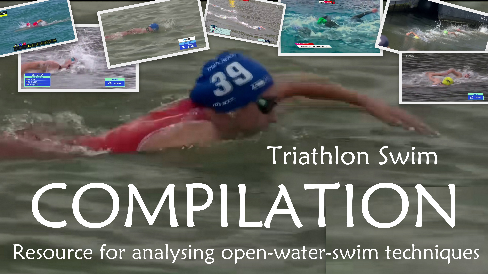
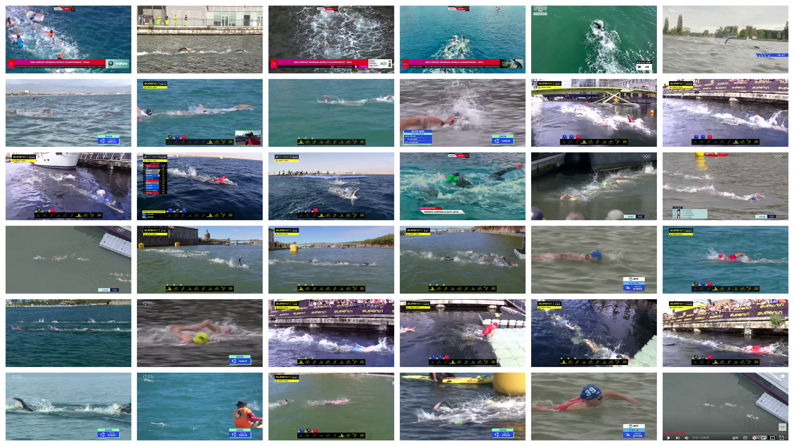

_The scripts of this repo can be used for any **automatic video compilation**, by creating a [compilation_config](compilation_configs) and personalizing [`create_text()`](src/compilation/utilities/utils_overlay_text.py)._

---

#  :swimmer:️ Elite Triathlon 2024 – Swimming Technique Compilation :swimmer:️

|                                      |
|:----------------------------------------------------------------------------------------------------------------------:|
| *How Elite Triathletes Swim - A 2024 Compilation :fast_forward: [YouTube link](https://youtu.be/gCwEpkmkF-o) :rewind:* |

---

This compilation is intended for coaches to **create educational video analyses** of **swimming techniques** specific to **open-water swimming** and **triathlon** racing.

It is purely for **educational and analytical** purposes.

### :clapper: What is Included?

The **compilation** consists of many short video clips showcasing **elite** male and female **triathletes** swimming in **real race** conditions.

- :movie_camera: Various **camera angles** for detailed technique breakdown.

- :ocean: Diverse **water conditions**: from calm lakes to rough, choppy seas.

- :straight_ruler: Multiple **race distances**: 300m, 750m, 1500m, 2000m and 3800m.

- :one_piece_swimsuit: Different **swim gears**: swimskins, tri-suits, and wetsuits.

- :checkered_flag: Different **swim phases** covered: start, middle, and end of the race (excluding sprint starts).

`#Triathlon` `#OpenWaterSwim` `#SwimmingTechnique` `#SwimAnalysis`

### Limitations

- No **underwater footage**: the catch and pull phases are not clearly visible.

- Footage primarily focuses on **race leaders**, who often swim in **relatively calm water**.
  - This may not reflect the experience of amateur triathletes, who typically race in **crowded packs** with more drafting and physical contact.

- **Elite** athletes may use different techniques than **amateur triathletes** (e.g., higher stroke rates).
  - However, many aspects - such as sighting, breathing and body position - remain **valuable for all swimmers**.

|  |
|:-------------------------------------------------------------:|
|                             * . *                             |

---
---

## :man_shrugging: Motivation

I have learned a lot from existing resources explaining **swimming techniques**, such as [@PierreCoachingNatation](https://www.youtube.com/@PierreCoachingNatation) :clap:.

However, most of them focus on **pool swimming** rather than **open-water** racing.

My **goal** is to understand two things:
- What makes **open-water swimming** (OWS) in triathlon different from **pool swimming**?
- How to **transfer skills from the pool** to real OWS race conditions?

---

## :mag: Key Open-Water Swimming Insights

I list below what I **have read and understood** from swim coaches.

### Main specificities of OWS
- **Sighting:** Sight first and then breathe
- **Drafting:** Either on the toes or on the hip

### Main OWS differences - compared to pool
- **Stroke rate:** Increased - but without sacrificing technique
- **Hand recovery:** Higher and wider
- **Hand entry:** More assertive
- **Breathing:** Slightly higher head position to account for waves
- **Stroke exit:** Slightly earlier to maintain a higher cadence

### Other OWS tips
- **Sight:** Every 6 to 12 strokes in straight line for navigation
- **Sight:** Quick: take a snapshot
- **Sight:** Not too high: crocodile eyes if possible, depending on the waves
- **Sight:** Time it with wave patterns (ideally at wave peaks)
- **Sight:** Look for tall landmarks
- **Sight:** Done via two movements:
  - Press on the water with the extended arm
  - Lift the head (and arch the back slightly)
- **Neck:** Return the head to a neutral, relaxed position after sighting
- **Head:** Keep the neck straight and the head looking down, to keep a straight line
- **Breath:** Example: 2-2-2-3 pattern to alternate breathing side
- **Breath:** Always keep a little extra air left
- **Style:** Asymmetrical: longer glide on one side, shorter on the other ("galloping stroke"?)
- **Kick:** Use a stronger kick just after sighting to maintain speed
- **Effort:** Accelerate after being slowed down by a wave
- **Effort:** Even or negative split
- Keep calm :innocent:

---

## :books: Resources

Some of my favourite videos:
- By Brenton Ford of [EffortlessSwimming](https://www.youtube.com/@EffortlessSwimming)
  - https://youtu.be/-6r3M4GGgIY
  - https://youtu.be/y1v0HacO1q4
  - https://youtu.be/Fk4lijTXl6A
  - https://youtu.be/Mr3W6itZwlc
  - https://effortlessswimming.teachable.com/p/the-art-of-triathlon-swimming
- By Leslie Thomas
  - https://youtu.be/v0-lP3exIfc
  - https://youtu.be/dRgdEnUYgKI :star:
  - https://youtu.be/omNLIGgtGHc
- By [Adam Walker](https://www.youtube.com/@adamwalker32)
  - https://youtu.be/AWuCdvx7UBg
  - https://youtu.be/cI-7GKB6W1A
  - https://youtu.be/7xCRrMqHh90
- https://youtu.be/LNxtdnQu1cU& by Keri-anne Payne
- https://youtu.be/GGG_QGGQtU4 by [Lucy Charles-Barclay](https://www.youtube.com/@LucyCharlesBarclay)

Other channels:
- [Global Triathlon Network](https://www.youtube.com/@gtn)
- [MySwimPro](https://www.youtube.com/@myswimpro) by [Fares Ksebati](https://www.youtube.com/@FaresKsebati)
- [U.S. Masters Swimming](https://www.youtube.com/@USMastersSwimming)

---

## :telescope: Some of My Observations of Elite Triathletes

- Breathing: Mostly **every 2 strokes**.
- Sighting: Very frequent!
  - Every **4, 6 or 8 strokes** on **straight sections**, used by both leaders and drafters.
    - Surprising to me: Even athletes drafting on toes **sight as often as leaders**.
  - Every 2 strokes around buoys.
- Stroke Rate:
  - Ranges **70-95 SPM**, averaging around 80-90 SPM.
  - Varies by race distance and swim style.
- Body Position: Head not fully submerged between strokes.
- Kick Pattern: Diverse.

---

## :scroll: My Open-Water Swimming Questions

I hope that coaches will re-use this video to **analyse, explain and illustrate** key concepts of **open-water swimming techniques** for **amateur triathletes**.

Here are some **questions I would love to get insights on**:

[Q1] What is the best way to **lift the head** for sighting?
- Should I **press more** with my extended arm, or rely on **arching my neck** (and my back)?

[Q2] How can I **avoid injuries**?
- I already have neck and back issues - how can I **sight without strain**?

[Q3] How do I **maintain good body position** while sighting?
- I feel my **hips drop** when I lift my head up.

[Q4] How do I keep an **effective catch & pull** while sighting?
- Pressing down on the water _(vertically)_ for sighting seems to **waste one stroke** to me: I cannot properly push the water towards my feet _(horizontally)_ for propulsion.
- Is there a better way?

[Q5] **How much** should sighting **slow me down**?
- If I swim 400m in the pool without sighting at 1:30/100m, what is an **acceptable pace loss** when **sighting every 6 strokes**?
- At what point (e.g., 1:32, 1:35, 1:40/100m) does the slowdown **indicate inefficient sighting technique** rather than just the natural cost of looking forward?

[Q6] **Which stroke rate** should I aim for as an **amateur**?
- It seems to depend on the **water conditions** and the morphology _(tall athletes tend to have lower stroke rates?)_.
- Pros generally seem to swim at 70-95 strokes per minute (SPM), but **should amateurs try to match this**, let's say on a 1500m course?

[Q7] How can I **increase my stroke rate** without losing efficiency? What **trade-offs** are acceptable?
- Should I **exit my arms earlier**, **glide less**, or **catch less water**?
- Should I increase **pull speed**? I already find it difficult to push the water - does this mean I need **more strength**?
- Elite swimmers do not seem to **fully extend their gliding arm** - why?

[Q8] Should my head be **fully submerged** between strokes?
- I was taught to aim for **full immersion** in pool swimming.
- Going low through chops sounds beneficial in OWS too, as it reduces **wave resistance**.
- However, many elite triathletes keep part of their **head out** - is it because they **sight often**?
- Should I still **prioritize full immersion**, especially outside sighting strokes?

[Q9] I have also learnt to turn around buoys using the "backstroke" technique.
- E.g. https://youtu.be/RqDT16YewrA
- But pros do not seem to use that at all.

---

## :wave: Next steps

I hope this video helps swimmers and coaches better understand open-water swimming (OWS) techniques.

In particular, **experts and coaches** can **use this compilation** to explain and illustrate key **concepts of OWS**, hopefully also sharing their analysis online.

Thanks for reading/watching, and happy swimming! :swimmer:

Cheers,
Simon :grinning:
